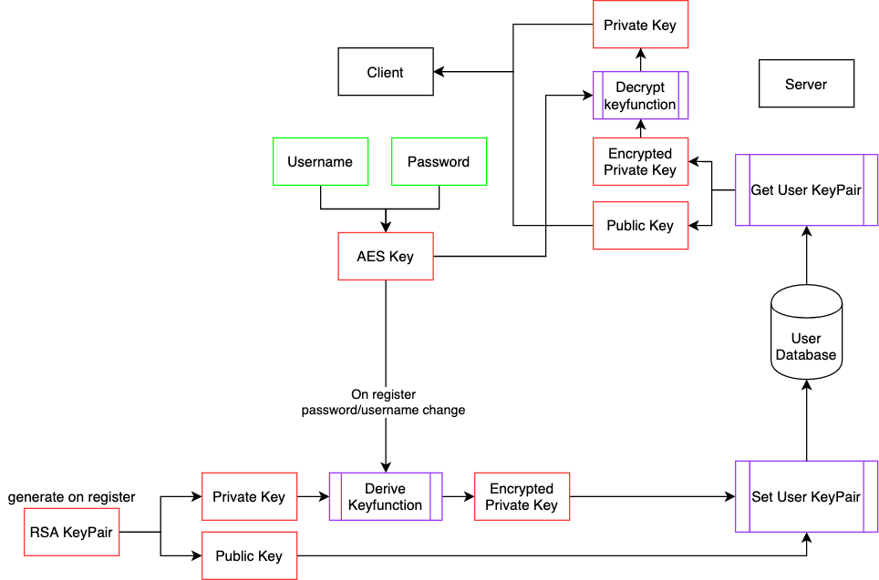

# gykivideo
## Archived: continued at [fosscord](http://github.com/fosscord)

## Ideas:

-   User  
-   Teacher  
-   Team - consists of: Classes & Users & Teachers  

-   Voice&Video MAINFOKUS  
-   Chat  
-   drawing field/Tafel  
-   Screenshare  
-   Backup

-   Schulen einbinden, eigene Datenbank
-   Invites
-   Finanzierung

## Key Managment:

